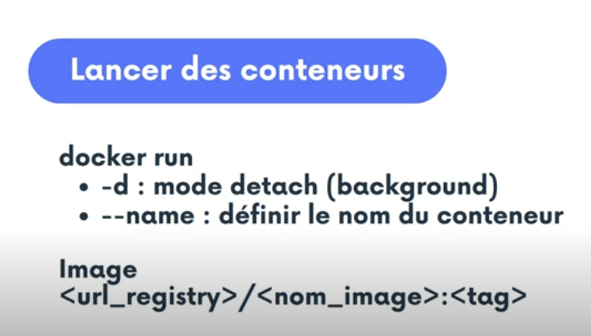

# inception

🔒 Configurer MariaDB avec Dockerfile + init.sql pour créer BDD + users.

🛠️ Configurer WordPress avec Dockerfile + script d’installation PHP + wp-cli.

🌐 Configurer NGINX avec TLS + redirection vers WordPress.

📜 Générer les certificats TLS avec openssl.

🧪 Tester la connexion à https://rhanitra.42.fr en local.

🧼 Gérer les bons utilisateurs WordPress, sécuriser, et enlever le tag latest.

Container : c'est l'activation d'une image de manière à faire tourner un processus.
    - 1 process (ou plusieurs)
    - isolation : cgroups / namespaces

Image : enveloppe de stockage
    - code du/des programmes
    - toutes les dépendances

 
ETAPE À SUIVRE
    1. Désinstallation des anciennes versions
    2. Mise en place du dépôt Docker
    3. Installation de docker, containerd, buildx...

Première étape:

    ## Suppression de la précédente version de Docker
    sudo apt remove docker docker-engine docker.io containerd runc

Deuxième étape:

    ## Mise en place du dépôt Docker
    sudo apt install ca-certificates curl gnupg lsb-release
    ## stockage de clé gpg
    sudo mkdir -m 0755 -p /etc/apt/keyrings
    curl -fsSL https://download.docker.com/linux/ubuntu/gpg | sudo gpg --dearmor -o /etc/apt/keyrings/docker.gpg

    echo \
    "deb [arch=$(dpkg --print-architecture) signed-by=/etc/apt/keyrings/docker.gpg] https://download.docker.com/linux/debian \
    $(lsb_release -cs) stable" | sudo tee /etc/apt/sources.list.d/docker.list > /dev/null

Troisième étape:

    ## Installation de docker
    sudo apt update
    sudo apt install docker-ce docker-ce-cli containerd.io docker-buildx-plugin docker-compose-plugin

    # curl -fsSL https://get.docker.com -o get-docker.sh

    ## Premier pas 

    docker ps
    docker run nginx:latest
    docker ps -a

    ## le -d va permettre de tourner en background le processus qui est à tenant (le nginx)
    docker run -d nginx:latest

#Lancement de conteneur

    docker run -d --name c1
    docker run -d --name c1 -p 8080:80 
    docker run -ti debian:latest
    docker run -ti --hostname c1 debian:latest
    docker run -ti --rm --hostname c1 debian:latest

    docker stop c1
    docker start c1
    docker rm -f c1

    docker rm -f $(docker ps -aq)

##Créer un volume

    docker volume create mynginx
    docker volume ls

    #Lancement de conteneur
    docker run -d --hostname -v mynginx:/usr/share/nginx/html/ --name c1 debian:latest
    docker exec -ti c1 bash

    #Supprimer des volumes
    docker volume rm mynginx

05-types-volumes
    ## Bind mount
    docker run -d --hostname --mount type=bind,src=/data/,destination=/usr/share/nginx/html/ --name c1 debian:latest

    ## Docker volume

    #Créer un volume
    docker volume create mynginx
    docker volume ls

    #Lancement de conteneur
    docker run -d --hostname --mount type=volume,src=mynginx,destination=/usr/share/nginx/html/ --name c1 debian:latest
    docker exec -ti c1 bash

    #Supprimer des volumes
    docker volume rm mynginx

    ## TMPFS
    docker run -d --hostname --mount type=tmpfs,destination=/usr/share/nginx/html/ --name c1 debian:latest

06- user-volumes

    # Création d'utilisateurs

    useradd -u 1111 xavki
    useradd -u 1110 xavki2

    # Construire une image
    cat Dockerfile 
    FROM debian:latest
    RUN useradd -u 1111 xavki
    RUN useradd -u 1112 xavki2

    # spécifions le user par l'ID (par le nom aussi)
    docker run -d --name c1 -u xavki -v /myvolume/:/data/ myowndebian:v1.0 sleep infinity

    ##

    # même user intérieur et extérieur
    docker run -d --name c1 -u xavki -v /myvolume/:/data/ myowndebian:v1.0 sleep infinity

    # même id mais nom différent
    docker run -d --name c1 -u 1111 -v /myvolume/:/data/ myowndebian:v1.0 sleep infinity

    # changement de user sur l'exec uniquement
    docker exec -ti xavki bash
    docker exec -ti xavki2 bash

    # permissions adaptées

    #jamais
    chmod 777 ... 

    #adapter les users

10-doker0

    cat /etc/docker/daemon.json
    #{
    #    "bip": "10.10.0.1/24",
    #    "dns": ["8.8.8.8","0.0.0.0"]
    #}

        --bip= network + mask bridge ip 

        --fixed-cidr= subnet

        --mtu= longueur des paquets sur docker0

        --default-gateway= spécifications de la gateway

        --dns=[]: liste des serveurs dns

    apt install bridge-utils net-tools iproute2
    docker network ls
    docker network inspect xxx
    brctl show

    docker network create -o com.docker.network.bridge.name=titi titi
    brctl show

    ip route
    ip link show type veth

    ip netns ls
    ls /var/run/netns/

    # pour docker
    ls /var/run/docker/netns/
    ip netns list-id

    # macaddress 2 ip
    docker network inspect bridge

11-xavki-0

    ## Variables Namespace
    NS1="x1"
    NS2="x2"

    ## Variables vethernet
    VETH1="xeth1"
    VETH2="xeth2"

    ## Variables interface des conteneurs
    VPEER1="xpeer1"
    VPEER2="xpeer2"

    # Variables ip des conteneurs
    VPEER_ADDR1="10.11.0.10"
    VPEER_ADDR2="10.11.0.20"

    ## Variables du bridge
    BR_ADDR="10.11.0.1"
    BR_DEV="xavki0"

    ## Création des namespaces
    ip netns add $NS1
    ip netns add $NS2

    ##Création des vethernet (cables) & interfaces
    ip link add ${VETH1} type veth peer name ${VPEER1}
    ip link add ${VETH2} type veth peer name ${VPEER2}

    ## Ajout des interfaces au namespace
    ip link set ${VPEER1} netns ${NS1}
    ip link set ${VPEER2} netns ${NS2}

    ## Activation des vethernet
    ip link set ${VETH1} up
    ip link set ${VETH2} up

    ip --netns ${NS1} a
    ip --netns ${NS2} a

    ## Activation des interfaces dans les namespaces
    ip netns exec ${NS1} ip link set lo up
    ip netns exec ${NS2} ip link set lo up
    ip netns exec ${NS1} ip link set ${VPEER1} up
    ip netns exec ${NS2} ip link set ${VPEER2} up

    ## Ajout des ip pour chaque interface
    ip netns exec ${NS1} ip addr add ${VPEER_ADDR1}/16 dev ${VPEER1}
    ip netns exec ${NS2} ip addr add ${VPEER_ADDR2}/16 dev ${VPEER2}

    ## Création et activation du bridge
    ip link add ${BR_DEV} type bridge
    ip link set ${BR_DEV} up

    ## Ajout des vethernet au bridge
    ip link set ${VETH1} master ${BR_DEV}
    ip link set ${VETH2} master ${BR_DEV}

    ## Ajout de l'ip du bridge
    ip addr add ${BR_ADDR}/16 dev ${BR_DEV}

    ## Ajout des routes poru chaque namespace pour passer par le bridge
    ip netns exec ${NS1} ip route add default via ${BR_ADDR}
    ip netns exec ${NS2} ip route add default via ${BR_ADDR}

    ## Accès externe
    echo 1 > /proc/sys/net/ipv4/ip_forward
    iptables -t nat -A POSTROUTING -s ${BR_ADDR}/16 ! -o ${BR_DEV} -j MASQUERADE

13-Dokerfile

